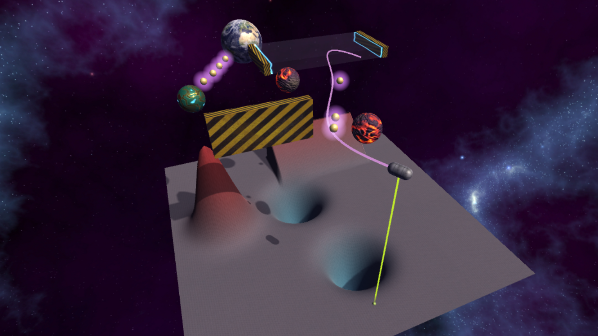

# Force Fields Potentials
3D Physics Serious Game

## Summary

[Serious Game](https://en.wikipedia.org/wiki/Serious_game) developed with Unity and a custom ECS library from the [LIP6 Serious Game team](http://seriousgames.lip6.fr/) to help you 
* understand the impact of initial speed on the trajectory of a moving object subject to forces
* anticipate the action of forces on the trajectory of a moving object by visualizing the energy potentials of objects and force fields (equation `f = -grad(EP)`).

You goal will be to reach Earth safely while collecting Seriousgamium on the way, a rare resource the world desperately needs.

## Installation & Start-up

* Download and install `Unity Editor 5.4.3f1` from the [Unity download archive](https://unity3d.com/get-unity/download/archive)
* Open the `FFP` folder with `Unity Editor 5.4.3f1`
* In the `Project` window
    * Click on `Assets` -> `Scenes`
    * Double click on the `MenuScene`
* In the `Game` window, make sure `Maximize on Play` is selected
* Click on the `Play` button. 
* All levels are unlocked so the game will automatically pick the last one if you click on `Play`. Make sure to start in `Levels` -> `Level 1` or `Tutorial` if you've never played before.

## Credits
Tanguy SOTO

Nicolas BILLOD

Guillaume LORTHIOIR

2017
